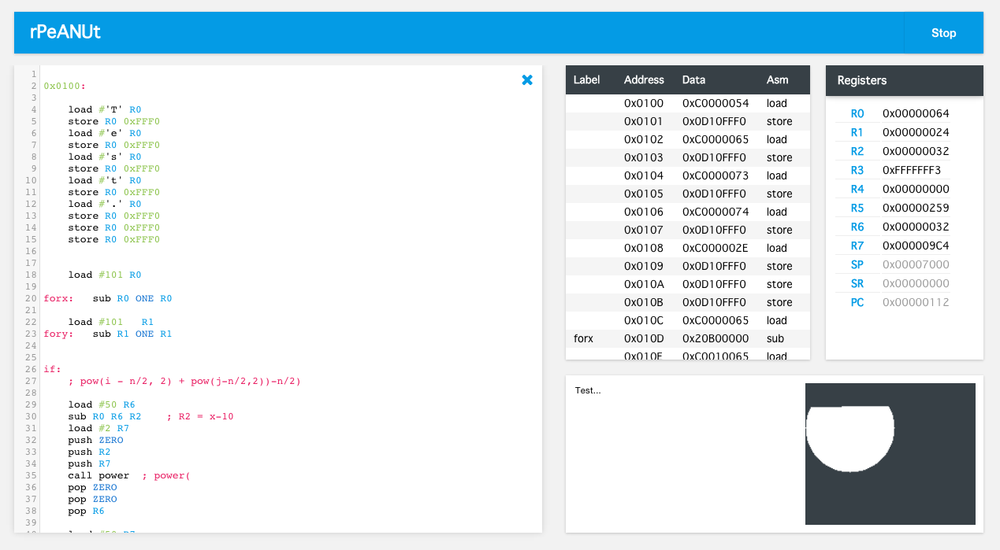

# rpeanut-js
rpeanut-js is a web-based IDE, assembler and emulator for the Australian National University (ANU)'s architecture rPeANUt.

## LIVE VERSION

[noiach.com/app/rnutjs](http://noiach.com/app/rnutjs)

Load the sample file, click `Assemble` and then `Run`. The program will print `Hello World!` to the console.

## Summary

The goal of this project was to create an IDE that would facilitate working across different devices. The original rPeANUt simulator is written in Java, which isn't supported by current iOS devices. Although this web implementation falls short in terms of speed (it will run at about 2/3rd the speed), it can be run on any modern browser (not tested in IE or Opera).

It makes use of HTML5 local storage and the Dropbox API to store and synchronize files across sessions and devices.

The IDE is mobile-web-app capable, allowing it to be run on mobile devices offline.

Currently supports:
  1. Break points
  2. Fast running (doesn't pause to refresh the UI)
  3. Dropbox sync and local storage

Features coming in future updates:
  1. Screndump
  2. Error-line highlighting

In the long run, the plan is to replace the rPeANUt emulator with a simulator that more closely matches the hardware.

Preview
=======

Image 1: Preview of running program.

Image 2: Preview of file storage.

